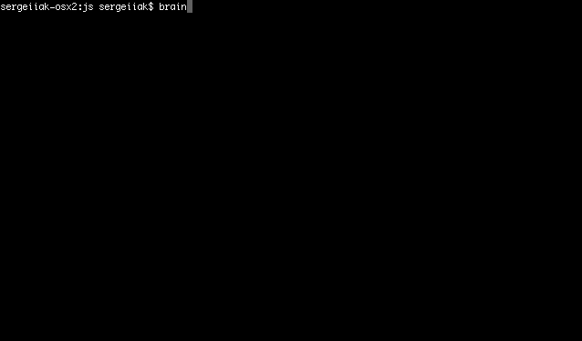

[](https://codeclimate.com/github/se0ga/project-lvl1-s320/maintainability)
[](https://codeclimate.com/github/se0ga/project-lvl1-s320)
[](https://travis-ci.com/se0ga/project-lvl1-s320)

# Project Brain Games on node.js
## Getting Started
### Install
```bash
$ npm i -g se0ga_brain_games
```

### Launch
1. This command will ask your name and say hello.
```bash
$ brain-games
```
<details><summary>How it works</summary>

  

</details>

2. This command will check that you know which number is even and which is not.
```bash
$ brain-even
```
<details><summary>How it works</summary>

  

</details>

3. This command will check that you remember how to make those operations +, -, * .
```bash
$ brain-calc
```
<details><summary>How it works</summary>

  

</details>

4. This command will check that you remember how to find greatest common divisor.
```bash
$ brain-gcd
```
<details><summary>How it works</summary>

  

</details>

5. This command will check that you know how to balance number.
```bash
$ brain-balance
```
<details><summary>How it works</summary>

  

</details>

6. This command will check that you know how to find missed number in arithmetic progression.
```bash
$ brain-progression
```
<details><summary>How it works</summary>

  

</details>

7. This command will check that you know which number is prime and which is not.
```bash
$ brain-prime
```
<details><summary>How it works</summary>

  

</details>